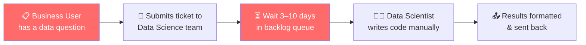
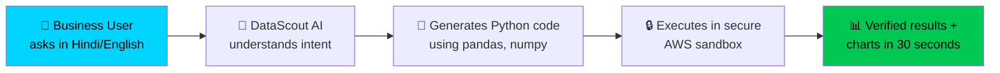
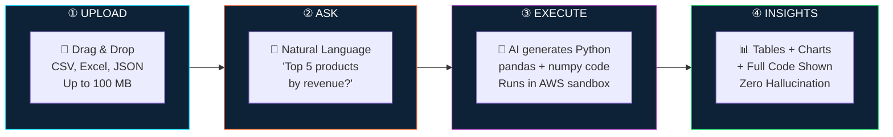
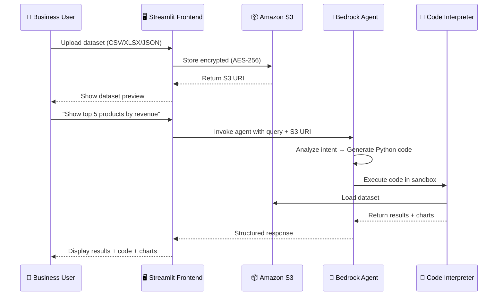
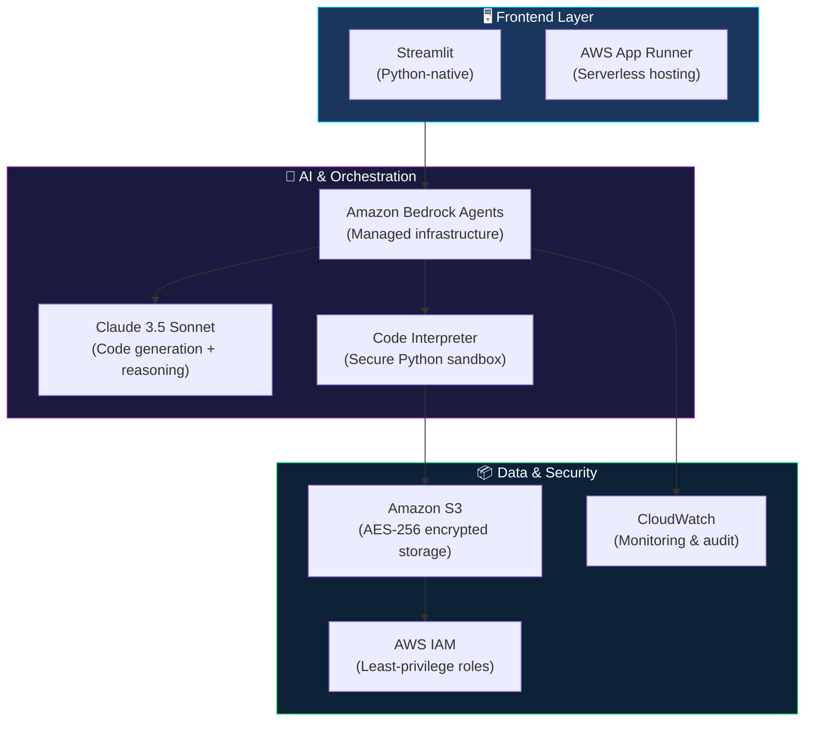
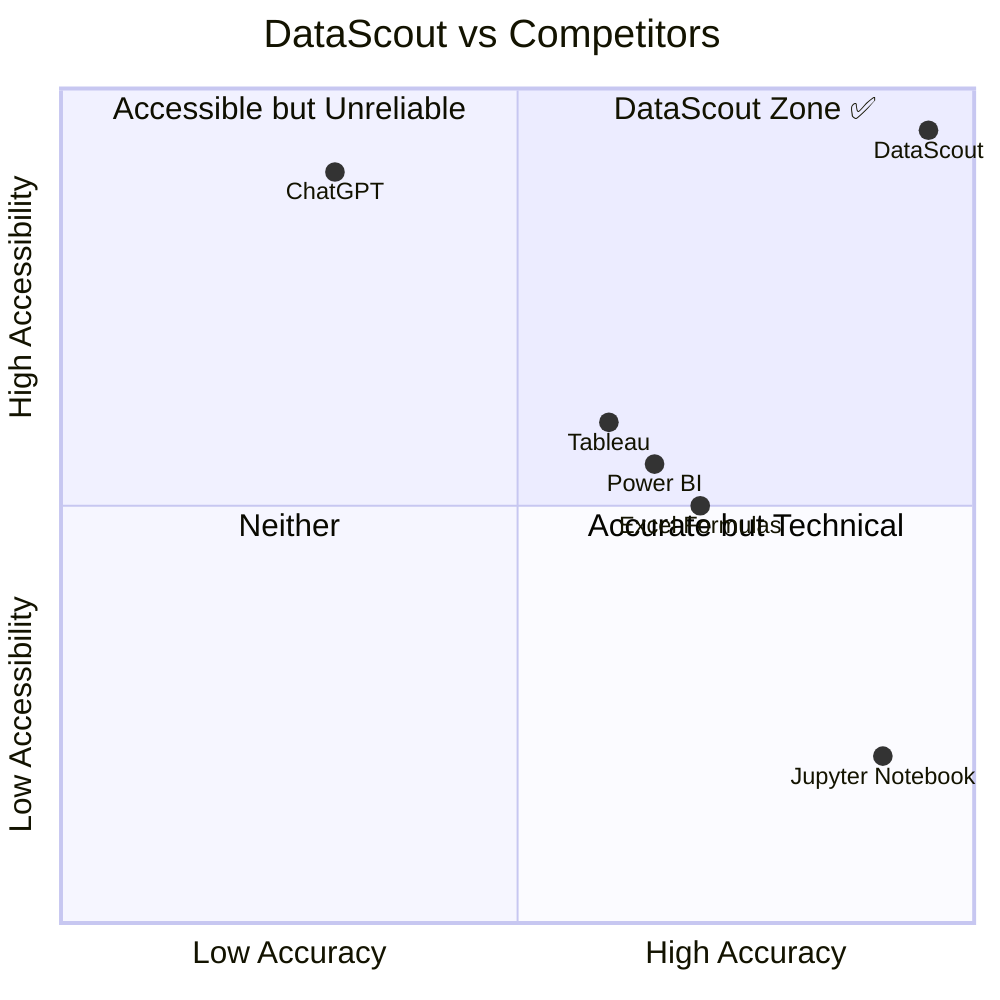
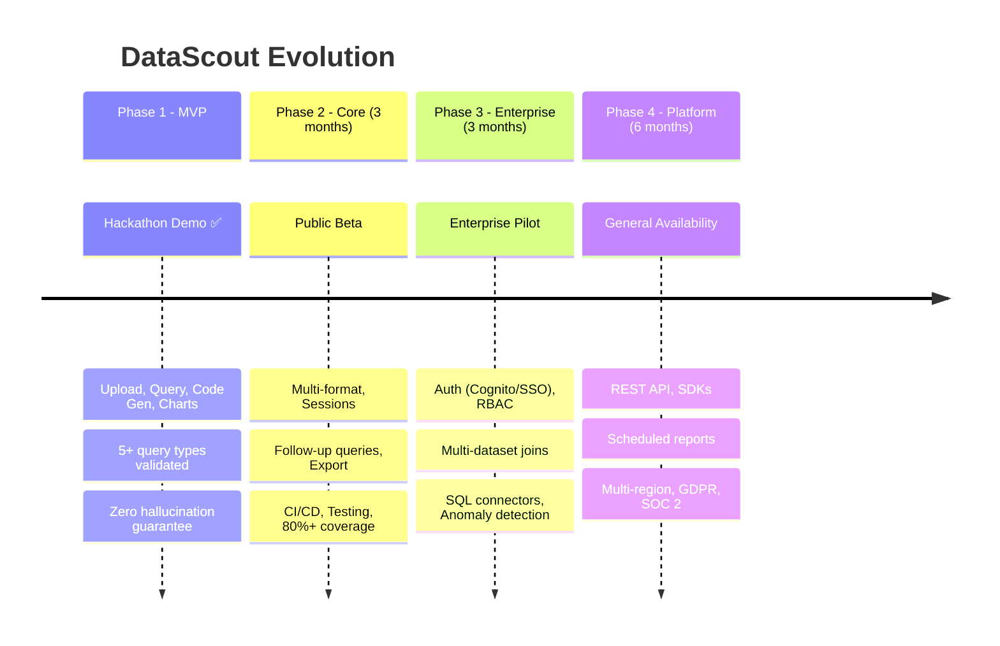
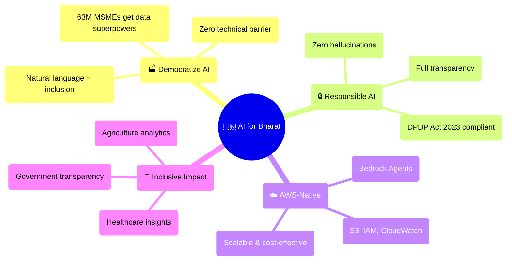

# 🔬 DataScout — Hackathon Presentation Guide

### AI for Bharat Hackathon • Amazon Web Services

> **One-Liner:** An AI-powered autonomous data analyst that eliminates hallucinations
> by executing real Python code — making enterprise analytics accessible to every
> Indian business user, in 30 seconds, from natural language.

**Team:** DataScout Development Team  
**Track:** AI for Bharat — Amazon Bedrock  
**Built With:** Claude 3.5 Sonnet • Amazon Bedrock Agents • Python • Streamlit  

---

## 📑 Slide-by-Slide Presentation Guide

Use this document as a comprehensive script and reference for each slide of your
hackathon presentation. Every section = one slide.

---

## SLIDE 1 — Cover Slide

### 🔬 DataScout
**Autonomous Enterprise Data Analyst**

*"Ask questions in English. Get 100% accurate, auditable answers in 30 seconds."*

- 🇮🇳 **AI for Bharat Hackathon** — Amazon Web Services
- ⚡ Powered by **Claude 3.5 Sonnet** on **Amazon Bedrock**
- 🛡️ Enterprise-grade security • Zero hallucinations • Full transparency

---

## SLIDE 2 — The Problem: India's Data Divide 🇮🇳

### 📊 India has 63 Million MSMEs. 99% can't use their own data.

India is generating more data than ever — GST records, sales data, inventory logs,
health records, agricultural data. But the insights are **locked away** because:




### The 4 Critical Pain Points

| # | Pain Point | Impact on India |
|---|-----------|-----------------|
| 🔴 **P1** | **Data Science Bottleneck** — Non-tech teams can't independently analyze data | 63M MSMEs delayed in decision-making |
| 🔴 **P2** | **AI Hallucinations** — ChatGPT-like tools fabricate numbers | Wrong business decisions, compliance violations |
| 🔴 **P3** | **No Transparency** — Black-box AI gives no methodology | Zero audit trail, regulatory risk |
| 🔴 **P4** | **Security Gaps** — Data sent to third-party servers | DPDP Act 2023 violations, data leakage |

> [!CAUTION]
> **Real-World Example:** A Jaipur textile manufacturer asks ChatGPT to analyze
> their sales CSV. ChatGPT *hallucinates* the revenue as ₹45 lakhs when the actual
> figure is ₹32 lakhs. The business owner makes a wrong expansion decision based
> on fabricated data.

---

## SLIDE 3 — The Solution: DataScout ✅

### From 10 days to 30 seconds. From hallucinated to deterministic.



### DataScout vs Traditional AI — Side by Side

| Feature | ❌ ChatGPT / Generic AI | ✅ DataScout |
|---------|------------------------|-------------|
| **How results are produced** | Text prediction (guessing) | Python code execution (computing) |
| **Numerical accuracy** | Often hallucinates numbers | **100% mathematically correct** |
| **Transparency** | Black box — hidden reasoning | **Full code shown to user** |
| **Auditability** | Not auditable | **Complete execution trace** |
| **Data privacy** | Data sent to third-party servers | **Data stays in your AWS account** |
| **Enterprise security** | Consumer-grade | **AES-256 encryption, IAM, audit logs** |

### The Core Innovation: Execution-Based Reasoning

> Traditional AI: *"I think the average revenue is approximately ₹1.5 lakhs"* ← **GUESS**
>
> DataScout: *"I executed `df['revenue'].mean()` → result: ₹1,47,234.56"* ← **FACT**

---

## SLIDE 4 — How It Works (4-Step Flow) 🔄



### What Happens Under the Hood

1. **Upload** — User drags their dataset. It's encrypted (AES-256) and stored in Amazon S3.
2. **Ask** — User types a question in plain English. No SQL, no Python, no training needed.
3. **Execute** — Claude 3.5 Sonnet on Bedrock *writes real Python code* and runs it in a secure, air-gapped sandbox (no internet, no system access, 30-sec timeout).
4. **Insights** — User sees: ① Explanation of approach, ② Computed results, ③ Full Python code, ④ Auto-generated charts.

> [!IMPORTANT]
> **Key Differentiator:** Every number shown to the user is the **output of executed
> code**, never a language model prediction. This guarantees **zero hallucinations**.

---

## SLIDE 5 — System Architecture 🏗️

### Fully Built on AWS — Production-Ready


### Architecture Breakdown

| Layer | Service | Purpose |
|-------|---------|---------|
| **Frontend** | Streamlit on AWS App Runner | Rapid, Python-native data app interface |
| **AI Brain** | Amazon Bedrock Agent (Claude 3.5 Sonnet) | Query understanding, code generation, validation |
| **Code Execution** | Bedrock Code Interpreter | Air-gapped Python sandbox (pandas, numpy, matplotlib) |
| **Storage** | Amazon S3 | Encrypted dataset storage with lifecycle policies |
| **Security** | AWS IAM | Least-privilege roles, session-scoped access |
| **Monitoring** | AWS CloudWatch | Logging, metrics, and audit trails |

### Data Flow Architecture



---

## SLIDE 6 — Live Demo Script 🎬

### Demo Walkthrough (3 minutes)

#### 🎯 Demo 1: Upload & Explore

```
1. Open DataScout → http://localhost:8501
2. Drag "sales_data.csv" (1,000 rows × 9 columns) into upload zone
3. Show: ✅ Row count, column count, file size auto-detected
4. Expand dataset preview → verify data loaded correctly
```

#### 🎯 Demo 2: Natural Language Queries

| Query | What to Show | Expected Result |
|-------|-------------|-----------------|
| *"What are the top 5 products by total revenue?"* | Results tab → sorted table | Table with 5 rows, descending by revenue |
| *"Show me monthly revenue trends"* | Charts tab → line chart | 12-month trend line with labels |
| *"What is the average revenue by region?"* | Code tab → Python code | `df.groupby('region')['revenue'].mean()` |
| *"What is the correlation between quantity and revenue?"* | Results tab → statistic | Correlation coefficient between -1 and 1 |
| *"Show the profit distribution across categories"* | Charts tab → histogram | Distribution chart with categories |

#### 🎯 Demo 3: Trust & Transparency

```
For each query, click through the 4 tabs:
  📝 Explanation  — "Here's what I did and why"
  📊 Results      — Tables and computed numbers
  💻 Code         — Full Python code (pandas, matplotlib)
  📈 Charts       — Auto-generated visualizations

Key talking point: "Every number you see is the OUTPUT of this code.
Nothing is guessed. Nothing is hallucinated."
```

---

## SLIDE 7 — Real-World Impact for India 🇮🇳


### How DataScout Solves Real Problems for Bharat

#### 🏭 MSMEs & Startups (63M+ businesses)

> A Surat diamond merchant uploads his sales spreadsheet and asks:
> *"Which stone cuts had the highest margin this quarter?"*
> DataScout runs the code and returns the answer in 30 seconds —
> no data scientist needed.

**Impact:** Enables India's 63M+ micro, small & medium enterprises to make
data-driven decisions without hiring expensive data science talent.

---

#### 🏛️ Government & Public Sector

> A district health officer uploads facility data and asks:
> *"Which PHCs have the lowest vaccination coverage?"*
> DataScout computes the exact numbers with methodology visible.

**Impact:** Transparent, auditable analysis of census, health, nutrition,
and education data for better policy decisions. Aligns with Digital India.

---

#### 🌾 Agriculture & Rural Economy

> A Kisan credit officer uploads crop loan data and asks:
> *"What is the default rate by crop type and district?"*
> DataScout returns the precise breakdown with charts.

**Impact:** Analyze crop yield patterns, market pricing (e-MANDI data),
weather correlations — empowering 150M+ Indian farmers.

---

#### 🏥 Healthcare

> A hospital administrator uploads patient flow data and asks:
> *"What's the average bed occupancy rate by department this month?"*
> DataScout computes it from the actual data with full code transparency.

**Impact:** Resource allocation, drug inventory optimization, and patient
flow analytics for India's 70,000+ hospitals.

---

#### 📈 BFSI (Banking, Financial Services, Insurance)

> A branch manager uploads transaction data and asks:
> *"Flag accounts with unusual transaction patterns"*
> DataScout runs statistical analysis with complete audit trail.

**Impact:** Fraud detection, portfolio analysis, and regulatory compliance
for India's rapidly digitizing financial sector. Compliant with DPDP Act 2023.

---

## SLIDE 8 — Tech Stack Deep Dive 🛠️



### Why This Stack?

| Choice | Why (for a hackathon AND production) |
|--------|--------------------------------------|
| **Claude 3.5 Sonnet** | Best-in-class code generation, handles pandas/numpy natively |
| **Bedrock Agents** | Managed orchestration — no custom agent framework needed |
| **Code Interpreter** | Pre-installed data science libraries in secure sandbox |
| **Streamlit** | Build data apps in Python — 10x faster than React for MVP |
| **Amazon S3** | Infinite scale, lifecycle policies, encryption built-in |
| **IAM** | Fine-grained access control without custom auth server |

### Security Highlights

| Measure | Implementation |
|---------|---------------|
| 🔒 Encryption at rest | AES-256 (S3 server-side) |
| 🔒 Encryption in transit | TLS 1.2+ |
| 🔒 Code isolation | Air-gapped sandbox, zero network access |
| 🔒 Data retention | Auto-delete after 7 days via S3 lifecycle |
| 🔒 Access control | IAM least-privilege, session-scoped |
| 🔒 Audit trail | Complete CloudWatch logging |
| 🔒 No model training | User data **never** used for LLM training |

---

## SLIDE 9 — Competitive Advantage 🏆

### Why DataScout Wins



### Our Moat: 5 Unfair Advantages

| # | Advantage | Why Competitors Can't Match |
|---|----------|----------------------------|
| 1 | **Deterministic accuracy** | Code execution, not text prediction |
| 2 | **Full transparency** | Every line of Python visible — auditable |
| 3 | **Enterprise security** | Air-gapped sandbox, data never leaves AWS |
| 4 | **Zero setup for users** | No SQL, no Python, no training needed |
| 5 | **Built on AWS native** | Bedrock, S3, IAM — scales from MSME to enterprise |

---

## SLIDE 10 — Business Model & Scalability 💰

### Freemium + Enterprise Model

```mermaid
graph LR
    subgraph Free["🆓 Free Tier"]
        F1["5 queries/day"]
        F2["10 MB file limit"]
        F3["CSV only"]
    end
    subgraph Pro["💳 Pro - ₹999/mo"]
        P1["Unlimited queries"]
        P2["100 MB files"]
        P3["CSV + Excel + JSON"]
        P4["Chart downloads"]
    end
    subgraph Ent["🏢 Enterprise"]
        E1["Custom deployment"]
        E2["SSO / RBAC"]
        E3["Multi-dataset joins"]
        E4["API access"]
        E5["SLA guarantee"]
    end
    Free --> Pro --> Ent
    style Free fill:#1a365d,stroke:#00d4ff,color:#fff
    style Pro fill:#2d1b69,stroke:#ff6b35,color:#fff
    style Ent fill:#0d2137,stroke:#00c853,color:#fff
```



### Market Opportunity in India

| Segment | TAM (India) | DataScout's Target |
|---------|------------|-------------------|
| MSME Analytics | 63M businesses × ₹999/mo | ₹750 Cr+ annual |
| Enterprise Data Teams | 10,000+ companies | ₹500 Cr+ annual |
| Government / PSU | 500+ departments | ₹200 Cr+ annual |

### Unit Economics

| Metric | Value |
|--------|-------|
| **Cost per query** | ~₹2-5 (Bedrock usage) |
| **Revenue per Pro user/month** | ₹999 |
| **Avg queries per Pro user/month** | ~100 |
| **Gross margin** | ~75-85% |

---

## SLIDE 11 — Roadmap 🗺️

### From Hackathon to Platform



### Key Milestones

| Date | Milestone | Target |
|------|-----------|--------|
| Feb 2026 | ✅ MVP Demo | 5 query types, zero hallucinations |
| May 2026 | Public Beta | 20+ beta users, NPS > 30 |
| Aug 2026 | Enterprise Pilot | 5+ enterprise customers |
| Feb 2027 | General Availability | 500+ users, 20+ enterprises |

---

## SLIDE 12 — Alignment with "AI for Bharat" Mission 🇮🇳

### How DataScout Serves India's AI Strategy



### India-Specific Value Propositions

| Amazon's Mission | DataScout's Contribution |
|-----------------|------------------------|
| **Democratize AI access** | Any business user can analyze data in natural language — no code needed |
| **Solve real Indian problems** | MSMEs, farmers, healthcare workers get data insights instantly |
| **Build on AWS services** | 100% AWS-native: Bedrock, S3, IAM, CloudWatch, App Runner |
| **Responsible & ethical AI** | Zero hallucinations, full code transparency, data stays in India (Mumbai region) |
| **Scale for Bharat** | From 1 user to 1 million — serverless, auto-scaling architecture |

---

## SLIDE 13 — Closing & Call to Action 🎯

### DataScout: Three Promises

```
   ┌─────────────────────────────────────────────────────────────┐
   │                                                             │
   │   🎯  PROMISE 1: Every number is COMPUTED, never guessed   │
   │                                                             │
   │   🎯  PROMISE 2: Every analysis is TRANSPARENT & auditable │
   │                                                             │
   │   🎯  PROMISE 3: Every dataset stays SECURE in your AWS    │
   │                                                             │
   └─────────────────────────────────────────────────────────────┘
```

### The One-Liner

> **DataScout is the autonomous data analyst that India's 63 million businesses
> deserve — accurate, transparent, secure, and accessible to everyone who can
> type a question in English.**

### What We're Asking For

- 🚀 **AWS Bedrock credits** to scale from demo to public beta
- 🤝 **Mentorship** from AWS Solutions Architects for enterprise security
- 🏆 **Recognition** to validate this approach for the Indian market
- 📢 **Distribution** through AWS Marketplace and Activate programs

---

## 📎 Appendix A — Demo Datasets

Pre-built demo data in `demo/datasets/`:

| File | Records | Columns | Use Case |
|------|---------|---------|----------|
| `sales_data.csv` | 1,000 | 9 | Revenue analysis, trends, product ranking |
| `customer_data.csv` | 500 | Multiple | Customer segmentation, demographics |
| `product_catalog.json` | 5 | Multiple | Product metadata, category analysis |

**Generate fresh demo data:**
```bash
python scripts/seed_demo_data.py
```

---

## 📎 Appendix B — Quick Setup Commands

```bash
# 1. Clone and install
git clone <repo-url>
cd Data_scout
python -m venv venv && source venv/bin/activate
pip install -r requirements.txt

# 2. Configure AWS
aws configure                          # Set up credentials
bash scripts/create_buckets.sh         # Create S3 bucket
bash scripts/create_iam_roles.sh       # Set up IAM roles
bash scripts/setup_agent.sh            # Deploy Bedrock Agent

# 3. Set environment variables
cp .env.example .env
# Edit .env → set BEDROCK_AGENT_ID and S3_BUCKET

# 4. Run the app
streamlit run streamlit_app/app.py
# Open http://localhost:8501
```

---

## 📎 Appendix C — Supported Query Types

| Category | Example Queries |
|----------|----------------|
| **Aggregation** | "What is the average/total/count of X?" |
| **Ranking** | "Top N products by revenue" |
| **Trending** | "Monthly/weekly trends of X over time" |
| **Correlation** | "Correlation between X and Y" |
| **Distribution** | "Distribution/histogram of X" |
| **Comparison** | "Compare X across regions/categories" |
| **Filtering** | "Show data where condition" |
| **Statistics** | "Descriptive statistics for column X" |

---

## 📎 Appendix D — Project Structure

```
Data_scout/
├── streamlit_app/            # 🖥️ Frontend application
│   ├── app.py               #    Main entry point
│   ├── config.py            #    Environment config loader
│   ├── components/          #    UI components (upload, query, results)
│   ├── services/            #    AWS integrations (Bedrock, S3)
│   └── utils/               #    Helpers (logging, errors)
├── demo/                    # 🎬 Demo assets
│   ├── datasets/            #    Pre-built demo datasets
│   └── demo_script.md       #    Step-by-step demo guide
├── scripts/                 # 🔧 Setup & automation
│   ├── setup_agent.sh       #    Deploy Bedrock Agent
│   ├── create_buckets.sh    #    Create S3 bucket
│   ├── create_iam_roles.sh  #    Set up IAM roles
│   └── seed_demo_data.py    #    Generate demo data
├── cloudformation/          # ☁️ Infrastructure as Code
│   └── datascout-stack.yaml #    Full stack template
├── Docs/                    # 📚 Documentation
├── tests/                   # 🧪 Test suite
├── .env.example             # ⚙️ Environment template
├── requirements.txt         # 📦 Dependencies
└── Dockerfile               # 🐳 Container config
```

---

**Built with ❤️ for Bharat** | **Powered by Amazon Bedrock** | **Zero Hallucinations, Full Transparency**
