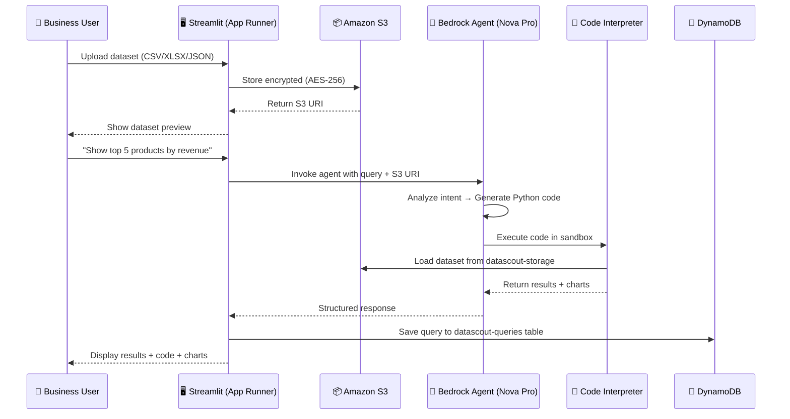

# 🔬 DataScout — Hackathon Presentation Guide

### AI for Bharat Hackathon • Amazon Web Services

> **One-Liner:** An AI-powered autonomous data analyst that eliminates hallucinations
> by executing real Python code — making enterprise analytics accessible to every
> Indian business user, in 30 seconds, from natural language.

**Team:** DataScout Development Team  
**Track:** AI for Bharat — Amazon Bedrock  
**Built With:** Amazon Nova Pro • Amazon Bedrock Agents • Python • Streamlit  

---

## 📑 Slide-by-Slide Presentation Guide

Use this document as a comprehensive script and reference for each slide of your
hackathon presentation. Every section = one slide. For each slide, you'll find:

- **Content** — What text/data to place
- **Image description** — Detailed description of visuals to use
- **PPT placement** — Exact layout instructions (what goes where on the slide)
- **Speaker notes** — What to say during the presentation

---

## SLIDE 1 — Cover Slide

### 🔬 DataScout
**Autonomous Enterprise Data Analyst**

*"Ask questions in English. Get 100% accurate, auditable answers in 30 seconds."*

- 🇮🇳 **AI for Bharat Hackathon** — Amazon Web Services
- ⚡ Powered by **Amazon Nova Pro** on **Amazon Bedrock**
- 🛡️ Enterprise-grade security • Zero hallucinations • Full transparency

### 🖼️ Image Description — Cover Slide
> **Image:** A futuristic dark-themed banner with the DataScout logo (a magnifying glass + data chart icon) centered, subtle animated circuit-board pattern in the background. The AWS and "AI for Bharat" logos are placed in the bottom right corner. A glowing gradient line (cyan → purple) sweeps across the bottom.

### 📐 PPT Placement — Cover Slide

| Element | Position | Size / Style |
|---------|----------|-------------|
| **DataScout Logo** | Top-center, 20% from top | 200×200px, glowing cyan border |
| **Title: "DataScout"** | Center, 35% from top | 54pt, bold, white, font: Inter/Outfit |
| **Subtitle: "Autonomous Enterprise Data Analyst"** | Center, below title | 24pt, light gray (#B0BEC5) |
| **One-liner quote** | Center, 50% from top | 18pt, italic, cyan (#00D4FF), in quotes |
| **3 bullet points** (AI for Bharat / Powered by / Enterprise-grade) | Center, 60% from top | 16pt, white, with emoji icons left-aligned |
| **Team name** | Bottom-left corner | 14pt, gray (#78909C) |
| **AWS + AI for Bharat logos** | Bottom-right corner | 80×30px each, side by side |
| **Background** | Full slide | Dark gradient (#0A0E27 → #1A1A3E), subtle grid pattern |

### 🎤 Speaker Notes
> "Hello everyone! We're Team DataScout, and we've built an autonomous AI data analyst that turns natural language questions into 100% accurate, computed answers — powered entirely by Amazon Bedrock and 9 AWS services."

---

## SLIDE 2 — The Problem: India's Data Divide 🇮🇳

### 📊 India has 63 Million MSMEs. 99% can't use their own data.

India is generating more data than ever — GST records, sales data, inventory logs,
health records, agricultural data. But the insights are **locked away** because:

### The 4 Critical Pain Points

| # | Pain Point | Impact on India |
|---|-----------|-----------------| 
| 🔴 **P1** | **Data Science Bottleneck** — Non-tech teams can't independently analyze data | 63M MSMEs delayed in decision-making |
| 🔴 **P2** | **AI Hallucinations** — ChatGPT-like tools fabricate numbers | Wrong business decisions, compliance violations |
| 🔴 **P3** | **No Transparency** — Black-box AI gives no methodology | Zero audit trail, regulatory risk |
| 🔴 **P4** | **Security Gaps** — Data sent to third-party servers | DPDP Act 2023 violations, data leakage |

### 🖼️ Image Description — Problem Slide

> **Image: `problem_solution.png`** — A split-screen before/after comparison:
> - **Left side (BEFORE — red tint):** A stressed businessman at a desk piled with papers, laptop showing an hourglass, clock showing "3-10 day wait". Below: ❌ Bottleneck, ❌ Hallucinations, ❌ No Transparency symbols in red.
> - **Right side (AFTER — green tint):** A happy businessman holding a tablet showing clean data dashboards, clock showing "30 seconds". Below: ✅ Self-Service, ✅ 100% Accurate, ✅ Full Transparency, ✅ Secure symbols in green.
> - **Center:** DataScout AI logo as the dividing element.
>
> **Use this existing file:** `Docs/problem_solution.png`

### 📐 PPT Placement — Problem Slide

| Element | Position | Size / Style |
|---------|----------|-------------|
| **Title: "India has 63 Million MSMEs..."** | Top, 10% from top, left-aligned | 36pt, bold, white |
| **Pain Points Table** | Left half, 30%–70% vertical | 4-row table, red accent (#FF6B6B) for icons, dark row backgrounds |
| **`problem_solution.png` image** | Right half, centered | 50% slide width, maintain aspect ratio |
| **Callout box (Real-World Example)** | Bottom, full width, 80%–95% vertical | 14pt, italic, inside a dark card with ⚠️ amber left border |
| **Background** | Full slide | Dark (#0D1117) with subtle red gradient on left |

> [!CAUTION]
> **Real-World Example (place in callout box):** A Jaipur textile manufacturer asks ChatGPT to analyze
> their sales CSV. ChatGPT *hallucinates* the revenue as ₹45 lakhs when the actual
> figure is ₹32 lakhs. The business owner makes a wrong expansion decision based
> on fabricated data.

### 🎤 Speaker Notes
> "India has 63 million MSMEs generating mountains of data. But 99% of them can't analyze it. They either wait days for a data team, or use ChatGPT which hallucinates numbers. Imagine a Jaipur textile manufacturer getting a revenue figure that's 40% wrong — and making a ₹10 lakh expansion decision based on that."

---

## SLIDE 3 — The Solution: DataScout ✅

### From 10 days to 30 seconds. From hallucinated to deterministic.

### DataScout vs Traditional AI — Side by Side

| Feature | ❌ ChatGPT / Generic AI | ✅ DataScout |
|---------|------------------------|-------------|
| **How results are produced** | Text prediction (guessing) | Python code execution (computing) |
| **Numerical accuracy** | Often hallucinates numbers | **100% mathematically correct** |
| **Transparency** | Black box — hidden reasoning | **Full code shown to user** |
| **Auditability** | Not auditable | **Complete execution trace** |
| **Data privacy** | Data sent to third-party servers | **Data stays in your AWS account** |
| **Enterprise security** | Consumer-grade | **AES-256 encryption, IAM, audit logs** |

### The Core Innovation: Execution-Based Reasoning

> Traditional AI: *"I think the average revenue is approximately ₹1.5 lakhs"* ← **GUESS**
>
> DataScout: *"I executed `df['revenue'].mean()` → result: ₹1,47,234.56"* ← **FACT**

### 🖼️ Image Description — Solution Slide

> **Create new image: Solution flow diagram** — A horizontal pipeline visual:
> 1. **User icon** (speaking bubble: "Top 5 products by revenue?")
> 2. **Arrow →** to **DataScout AI brain** (Nova Pro logo inside a glowing orb)
> 3. **Arrow →** to **Python code block** (`df.groupby('product')['revenue'].sum().nlargest(5)`)
> 4. **Arrow →** to **AWS Sandbox shield** (showing "Secure Execution")
> 5. **Arrow →** to **Results dashboard** (table + chart)
>
> Color palette: dark background, cyan arrows, purple AI glow, green results.

### 📐 PPT Placement — Solution Slide

| Element | Position | Size / Style |
|---------|----------|-------------|
| **Title: "From 10 days to 30 seconds"** | Top, 8% from top | 36pt, bold, white |
| **Comparison Table** | Left half, 25%–65% vertical | 6-row table, red highlights for ChatGPT column, green for DataScout |
| **Core Innovation callout** | Right half, 25%–45% vertical | Dark card, code font for `df['revenue'].mean()`, larger font for the ₹ result |
| **Solution flow diagram image** | Bottom half, full width, 70%–95% | Horizontal pipeline, evenly spaced icons |
| **Background** | Full slide | Dark (#0A0E27), subtle green gradient on right side |

### 🎤 Speaker Notes
> "DataScout doesn't guess. It writes real Python code using pandas and numpy, executes it inside a secure AWS sandbox, and returns the computed result. Every number you see is the output of actual code — never a language model prediction. That's our core innovation: execution-based reasoning."

---

## SLIDE 4 — How It Works (4-Step Flow) 🔄

### 🖼️ Image Description — 4-Step Flow

> **Create new image: 4-step horizontal infographic** — Four connected hexagonal/circular cards on a dark background:
>
> | Step | Icon | Label | Detail |
> |------|------|-------|--------|
> | ①  | 📁 Upload icon | **UPLOAD** | "Drag & Drop CSV, Excel, JSON — Up to 100 MB" |
> | ②  | 💬 Chat bubble | **ASK** | "Natural Language — 'Top 5 products by revenue?'" |
> | ③  | 🐍 Python logo | **EXECUTE** | "AI generates pandas + numpy code → Runs in AWS sandbox" |
> | ④  | 📊 Dashboard | **INSIGHTS** | "Tables + Charts + Full Code Shown — Zero Hallucination" |
>
> Connecting line between each step with glowing arrows. Each card has a distinct border color:
> - Upload = cyan (#00D4FF)
> - Ask = orange (#FF6B35)
> - Execute = purple (#9C27B0)
> - Insights = green (#00C853)

### What Happens Under the Hood

1. **Upload** — User drags their dataset. It's encrypted (AES-256) and stored in **Amazon S3** (`datascout-storage` bucket).
2. **Ask** — User types a question in plain English. No SQL, no Python, no training needed.
3. **Execute** — Amazon Nova Pro on Bedrock *writes real Python code* and runs it in a secure, air-gapped sandbox (no internet, no system access, 30-sec timeout).
4. **Insights** — User sees: ① Explanation of approach, ② Computed results, ③ Full Python code, ④ Auto-generated charts.

### 📐 PPT Placement — 4-Step Flow

| Element | Position | Size / Style |
|---------|----------|-------------|
| **Title: "How It Works"** | Top, 8% from top | 36pt, bold, white |
| **4-step infographic** | Center, 20%–55% vertical, full width | 4 equal cards, each ~22% width, connected by arrows |
| **"Under the Hood" details** | Below cards, 60%–90% vertical | 4 numbered items, 14pt, with matching color dot for each step |
| **Highlight box** | Bottom-center | Cyan border card: "Key Differentiator: Every number is the OUTPUT of executed code, never a language model prediction" |
| **Background** | Full slide | Dark (#0D2137), subtle geometric pattern |

> [!IMPORTANT]
> **Key Differentiator (place in highlight box):** Every number shown to the user is the **output of executed
> code**, never a language model prediction. This guarantees **zero hallucinations**.

### 🎤 Speaker Notes
> "The flow is dead simple. Upload your dataset — it gets encrypted and stored in S3. Ask a question in plain English. Our AI agent powered by Amazon Nova Pro writes Python code, executes it in a secure AWS sandbox, and shows you the results with full code transparency. Four steps. Thirty seconds."

---

## SLIDE 5 — System Architecture 🏗️

### Fully Built on AWS — 9 Services, Production-Ready

### 🖼️ Image Description — Architecture Diagram

> **Use existing image: `Docs/system_architecture.png`** — A dark-themed, professional system architecture diagram showing:
> - **Top:** User icon → "Natural Language Query" arrow → Streamlit Frontend (AWS App Runner) box with Upload/Query/Results icons
> - **Center:** boto3 SDK arrow → Amazon Bedrock Agent (shows "Query Understanding → Code Generation → Validation" pipeline)
> - **Left:** Code Interpreter box with pandas, numpy, matplotlib library icons
> - **Right:** Amazon S3 bucket (Encrypted Datasets)
> - **Bottom:** AWS CloudWatch (Monitoring & Logging) bar spanning full width
> - **Color palette:** Dark navy (#0A0E27) background, cyan (#00D4FF) glow borders, green accent for S3

### Architecture Breakdown — All 9 AWS Services

| Layer | AWS Service | What It Does | Live Resource |
|-------|------------|-------------|---------------|
| **Frontend** | AWS App Runner | Hosts Streamlit web app, auto-scaling | Service: `datascout-frontend-prod` |
| **AI Brain** | Amazon Bedrock Agent | Query understanding, code generation | Agent ID: `2V8KLCC97S`, Alias: `ADO5CA4VCF` |
| **AI Model** | Amazon Nova Pro | Cross-region inference, code generation | Model: Nova Pro (Cross-region) |
| **Code Execution** | Bedrock Code Interpreter | Secure Python sandbox (pandas, numpy, matplotlib) | Built into Bedrock Agent |
| **File Storage** | Amazon S3 | AES-256 encrypted dataset storage, 7-day lifecycle | Bucket: `datascout-storage` |
| **Database** | Amazon DynamoDB | Query history, session persistence, PAY_PER_REQUEST | Table: `datascout-queries` |
| **API** | AWS Lambda | Serverless REST API (Python 3.11, 256 MB) | Function: `datascout-api` |
| **API Routing** | Amazon API Gateway | HTTP endpoints: `/health`, `/analyze`, `/history` | Stage: `prod`, API ID: `r19ewjwx53` |
| **Security** | AWS IAM | 3 least-privilege roles (AppRunner, Bedrock, Lambda) | Roles created ✅ |
| **Monitoring** | AWS CloudWatch | Centralized logs, metrics, alarms | Log group configured |

### 📐 PPT Placement — Architecture Slide

| Element | Position | Size / Style |
|---------|----------|-------------|
| **Title: "System Architecture — 9 AWS Services"** | Top, 5% from top | 32pt, bold, white |
| **`system_architecture.png`** | Left 55% of slide, 15%–85% vertical | Full resolution, maintain aspect ratio |
| **AWS Service table** | Right 42% of slide, 15%–85% vertical | Compact 10-row table, 11pt font, alternating dark row colors, AWS orange accents for service names |
| **"Fully Built on AWS" badge** | Top-right corner | Small badge icon with "9 AWS Services" and AWS logo |
| **Background** | Full slide | Dark (#0A0E27), no distracting patterns |

### Data Flow Architecture (for animated version)



### 🎤 Speaker Notes
> "This architecture is fully production-ready with 9 AWS services. The user interacts with Streamlit on App Runner. Queries go to our Bedrock Agent running Amazon Nova Pro, which writes and executes Python code in a sandboxed Code Interpreter. Data is encrypted in S3, sessions persist in DynamoDB, and everything is monitored through CloudWatch. All services are live — I'll show you the AWS console in a moment."

---

## SLIDE 6 — AWS Infrastructure Deep Dive ☁️

### ⚡ Live Infrastructure — All Services Deployed & Tested

> [!NOTE]
> This slide is NEW — showcases the real deployed infrastructure to prove it's not just a demo.

### Deployed Infrastructure Reference

| AWS Service | Resource Name / ID | Status | Key Config |
|------------|-------------------|--------|-----------|
| **IAM User** | `datascout-developer` (Account: 466492745516) | ✅ Active | us-east-1 region |
| **S3 Bucket** | `datascout-storage` | ✅ Active | AES-256, public access blocked, 7-day lifecycle |
| **IAM Roles** | `DataScout-AppRunnerRole`, `DataScout-BedrockAgentRole`, `DataScout-LambdaRole` | ✅ Created | Least-privilege policies |
| **Bedrock Agent** | Agent: `2V8KLCC97S`, Alias: `ADO5CA4VCF` | ✅ PREPARED | Nova Pro (Cross-region), Code Interpreter ON |
| **DynamoDB** | Table: `datascout-queries` | ✅ Active | PAY_PER_REQUEST, TTL enabled (7 days) |
| **Lambda** | `datascout-api` (Python 3.11, 256 MB, 60s timeout) | ✅ Active | Bedrock + DynamoDB + S3 access |
| **API Gateway** | Base: `https://r19ewjwx53.execute-api.us-east-1.amazonaws.com/prod` | ✅ Deployed | 3 endpoints: `/health`, `/analyze`, `/history/{session_id}` |

### Verified Working End-to-End

| Verification | Result |
|-------------|--------|
| Local URL: `http://localhost:8501` | ✅ Running |
| DynamoDB Persistence | ✅ Verified (Session: `ab3e47cd-...`) |
| Chart Generation | ✅ Working (`top_10_customers.png`) |
| Query Execution Time | ~40 seconds ✅ |
| Unit Tests | 86 passed ✅ |
| API Health Check | ✅ `{ "status": "ok" }` |

### 🖼️ Image Description — AWS Infrastructure Slide

> **Create new image: AWS service icons grid** — A 3×3 grid of AWS service icons on a dark background:
> - Row 1: S3 (storage bucket icon), Bedrock (brain/AI icon), DynamoDB (database icon)
> - Row 2: Lambda (λ symbol), API Gateway (gateway icon), IAM (lock/shield icon)
> - Row 3: CloudWatch (monitor icon), App Runner (rocket icon), CloudFormation (stack icon)
> Each icon has a glowing green checkmark (✅) overlay. Connecting dotted lines between related services.
>
> **Alternatively, use AWS console screenshots** of each service dashboard showing live resources.

### 📐 PPT Placement — AWS Infrastructure Slide

| Element | Position | Size / Style |
|---------|----------|-------------|
| **Title: "Live AWS Infrastructure"** | Top, 5% from top | 32pt, bold, white, with ☁️ emoji |
| **Deployed Infrastructure table** | Left 55%, 15%–75% vertical | 7-row compact table, green checkmarks, AWS orange service names |
| **Verification Results table** | Right 42%, 15%–55% vertical | 6-row mini table, all green ✅, dark card background |
| **AWS Service icons grid OR console screenshots** | Bottom, 75%–95% vertical, full width | A strip of 9 small AWS icons with labels below each |
| **Cost callout** | Bottom-right | Small text: "Total cost: ~$6–27/month" in gray |
| **Background** | Full slide | Dark (#0D1117), subtle AWS orange gradient at edges |

### 🎤 Speaker Notes
> "Let me show you this isn't just a prototype. We have 9 AWS services fully deployed and verified. Our Bedrock Agent with ID 2V8KLCC97S is PREPARED and ready. The API Gateway serves three production endpoints. DynamoDB persists query history with automatic TTL cleanup. Every piece of infrastructure is live and tested — 86 unit tests passing."

---

## SLIDE 7 — Live Demo Script 🎬

### Demo Walkthrough (3 minutes)

#### 🎯 Demo 1: Upload & Explore

```
1. Open DataScout → http://localhost:8501
2. Drag "sales_data.csv" (1,000 rows × 9 columns) into upload zone
3. Show: ✅ Row count, column count, file size auto-detected
4. Expand dataset preview → verify data loaded correctly
```

#### 🎯 Demo 2: Natural Language Queries

| Query | What to Show | Expected Result |
|-------|-------------|-----------------| 
| *"What are the top 5 products by total revenue?"* | Results tab → sorted table | Table with 5 rows, descending by revenue |
| *"Show me monthly revenue trends"* | Charts tab → line chart | 12-month trend line with labels |
| *"What is the average revenue by region?"* | Code tab → Python code | `df.groupby('region')['revenue'].mean()` |
| *"What is the correlation between quantity and revenue?"* | Results tab → statistic | Correlation coefficient between -1 and 1 |
| *"Show the profit distribution across categories"* | Charts tab → histogram | Distribution chart with categories |

#### 🎯 Demo 3: Trust & Transparency

```
For each query, click through the 4 tabs:
  📝 Explanation  — "Here's what I did and why"
  📊 Results      — Tables and computed numbers
  💻 Code         — Full Python code (pandas, matplotlib)
  📈 Charts       — Auto-generated visualizations

Key talking point: "Every number you see is the OUTPUT of this code.
Nothing is guessed. Nothing is hallucinated."
```

#### 🎯 Demo 4: AWS Console Showcase (Optional — 1 minute)

```
1. Open AWS Console → Show DynamoDB table "datascout-queries" with saved queries
2. Open S3 Console → Show "datascout-storage" bucket with encrypted dataset
3. Open Bedrock Console → Show Agent "2V8KLCC97S" status = PREPARED
4. Open API Gateway → Show 3 live endpoints
5. Hit health endpoint: https://r19ewjwx53.execute-api.us-east-1.amazonaws.com/prod/health
```

### 🖼️ Image Description — Demo Slide

> **Create new image (or use app screenshots): Demo collage** — A 2×2 grid showing:
> 1. **Top-left:** DataScout upload screen with a CSV file being dragged
> 2. **Top-right:** Query results showing a sorted table with revenue numbers
> 3. **Bottom-left:** Code tab showing Python pandas code
> 4. **Bottom-right:** Charts tab showing a bar chart
>
> Each screenshot has a thin cyan border and a label (Upload → Ask → Code → Results).

### 📐 PPT Placement — Demo Slide

| Element | Position | Size / Style |
|---------|----------|-------------|
| **Title: "Live Demo"** | Top, 5% from top | 36pt, bold, white, with 🎬 |
| **Demo 1 box: Upload** | Top-left quadrant, 15%–45% | Dark card, numbered steps, upload icon |
| **Demo 2 box: Query table** | Top-right quadrant, 15%–45% | 5-row query table with color-coded Expected Result column |
| **Demo 3 box: Transparency** | Bottom-left quadrant, 55%–85% | 4-tab mockup (Explanation/Results/Code/Charts), highlight "Code" tab |
| **Demo 4 box: AWS Console** | Bottom-right quadrant, 55%–85% | Small AWS Console screenshot or icon list |
| **Background** | Full slide | Dark (#0D2137) |

### 🎤 Speaker Notes
> "Let me show you DataScout in action. I'm uploading a real 1,000-row sales dataset. Now watch — I ask 'Top 5 products by revenue' and within 30 seconds, I get computed results, the actual Python code, and auto-generated charts. Let me also pop over to the AWS console to show you the DynamoDB table saving this query and the S3 bucket storing the encrypted file."

---

## SLIDE 8 — Real-World Impact for India 🇮🇳

### How DataScout Solves Real Problems for Bharat

### 🖼️ Image Description — India Impact

> **Use existing image: `Docs/india_impact.png`** — "AI FOR BHARAT IMPACT" infographic showing:
> - **Center:** Outline map of India with glowing connection nodes at major cities (Mumbai, Bengaluru, Chennai) and network lines across the country
> - **Top-left card:** "MSME Empowerment" — 63M businesses, AI for process automation, market access & financial inclusion
> - **Top-right card:** "Government Transparency" — AI-driven governance, fraud detection & citizen services
> - **Bottom-left card:** "Healthcare Optimization" — Hospital efficiency, AI for resource allocation & telemedicine
> - **Bottom-right card:** "Agriculture Innovation" — Farmer empowerment, AI for crop monitoring, yield prediction & smart irrigation
> - **Style:** Dark tech background with circuit-board patterns, glowing accent colors

### Impact by Sector

| Sector | Use Case Example | Impact Statement |
|--------|-----------------|-----------------|
| 🏭 **MSMEs** (63M+) | Surat diamond merchant: "Which stone cuts had the highest margin this quarter?" | Data-driven decisions without hiring data scientists |
| 🏛️ **Government** | District health officer: "Which PHCs have the lowest vaccination coverage?" | Transparent, auditable analysis for policy decisions |
| 🌾 **Agriculture** (150M+ farmers) | Kisan credit officer: "Default rate by crop type and district?" | Crop yield analysis, e-MANDI pricing insights |
| 🏥 **Healthcare** (70,000+ hospitals) | Hospital admin: "Average bed occupancy by department this month?" | Resource allocation and patient flow optimization |
| 📈 **BFSI** | Branch manager: "Flag accounts with unusual transaction patterns" | Fraud detection with complete audit trail, DPDP Act compliant |

### 📐 PPT Placement — India Impact Slide

| Element | Position | Size / Style |
|---------|----------|-------------|
| **Title: "Real-World Impact for India"** | Top, 5% from top | 32pt, bold, white, with 🇮🇳 |
| **`india_impact.png`** | Left 50% of slide, 15%–90% vertical | Full resolution, maintain aspect ratio |
| **Sector Impact table** | Right 48%, 15%–90% vertical | 5-row table with emoji icons, alternating dark rows; quote examples in italic |
| **Background** | Full slide | Dark (#0A0E27), matching the india_impact.png style |

### 🎤 Speaker Notes
> "DataScout isn't just a tech demo — it solves real problems for real Indians. Imagine a Surat diamond merchant instantly analyzing margins, or a district health officer identifying under-vaccinated areas in seconds. From MSMEs to farmers to banks, DataScout brings data superpowers to everyone."

---

## SLIDE 9 — Tech Stack & Security Deep Dive 🛠️

### Why This Stack?

| Choice | Why (for a hackathon AND production) |
|--------|--------------------------------------|
| **Amazon Nova Pro** | Cross-region inference, excellent code generation, handles pandas/numpy natively |
| **Bedrock Agents** | Managed orchestration — no custom agent framework needed |
| **Code Interpreter** | Pre-installed data science libraries in secure sandbox |
| **Streamlit** | Build data apps in Python — 10x faster than React for MVP |
| **Amazon S3** | Infinite scale, lifecycle policies, encryption built-in |
| **DynamoDB** | Serverless, pay-per-request, auto-scaling, TTL cleanup |
| **Lambda** | Serverless REST API, pay-per-invocation, zero infra management |
| **API Gateway** | Managed HTTP routing, throttling, prod stage deployment |
| **IAM** | Fine-grained access control: 3 dedicated roles with least-privilege policies |

### Security Highlights

| Measure | Implementation | AWS Service |
|---------|---------------|-------------|
| 🔒 Encryption at rest | AES-256 (S3 server-side encryption) | Amazon S3 |
| 🔒 Encryption in transit | TLS 1.2+ | All services |
| 🔒 Code isolation | Air-gapped sandbox, zero network access | Bedrock Code Interpreter |
| 🔒 Data retention | Auto-delete after 7 days via lifecycle policy | S3 + DynamoDB TTL |
| 🔒 Access control | 3 IAM roles: AppRunner, Bedrock, Lambda — all least-privilege | AWS IAM |
| 🔒 API Security | Regional endpoints, NONE auth (hackathon) — production: API keys + Cognito | API Gateway |
| 🔒 Audit trail | Complete CloudWatch logging for all services | CloudWatch |
| 🔒 No model training | User data **never** used for LLM training | Amazon Bedrock |

### 🖼️ Image Description — Tech Stack Slide

> **Create new image: Tech stack layered diagram** — Three horizontal layers stacked vertically:
> - **Top layer (blue):** "Frontend Layer" — Streamlit + App Runner icons
> - **Middle layer (purple):** "AI & Orchestration" — Bedrock Agent + Nova Pro + Code Interpreter icons
> - **Bottom layer (green):** "Data & Security" — S3 + DynamoDB + IAM + CloudWatch + Lambda + API Gateway icons
> Connecting arrows between layers. Left sidebar shows security shields with lock icons.

### 📐 PPT Placement — Tech Stack Slide

| Element | Position | Size / Style |
|---------|----------|-------------|
| **Title: "Tech Stack & Security"** | Top, 5% | 32pt, bold, white, with 🛠️ |
| **"Why This Stack" table** | Left 50%, 15%–55% | 9-row table, bold AWS service names, compact 12pt |
| **Security Highlights table** | Left 50%, 58%–95% | 8-row table with 🔒 emoji, green text for Implementation |
| **Tech stack layered diagram** | Right 48%, 15%–70% | 3-layer visual, color-coded borders |
| **Cost box** | Right bottom, 75%–95% | Dark card: "Running cost: $6–27/month on AWS" |
| **Background** | Full slide | Dark (#0D2137) |

### 🎤 Speaker Notes
> "We didn't just pick AWS services randomly. Nova Pro gives us best-in-class code generation. Bedrock Agents handle the orchestration. S3 encrypts everything at rest with AES-256. DynamoDB auto-scales and cleans up old queries. Three separate IAM roles ensure least-privilege access. And the whole thing costs just $6 to $27 a month."

---

## SLIDE 10 — Competitive Advantage 🏆

### Why DataScout Wins

### Our Moat: 5 Unfair Advantages

| # | Advantage | Why Competitors Can't Match |
|---|----------|----------------------------|
| 1 | **Deterministic accuracy** | Code execution, not text prediction |
| 2 | **Full transparency** | Every line of Python visible — auditable |
| 3 | **Enterprise security** | Air-gapped sandbox, data never leaves AWS |
| 4 | **Zero setup for users** | No SQL, no Python, no training needed |
| 5 | **Built on AWS native** | 9 services: Bedrock, S3, IAM, DynamoDB, Lambda, API GW, CloudWatch, App Runner, CloudFormation |

### 🖼️ Image Description — Competitive Advantage

> **Create new image: Quadrant chart** — A 2×2 quadrant with axes:
> - X-axis: "Low Accuracy → High Accuracy"
> - Y-axis: "Low Accessibility → High Accessibility"
> - Quadrant labels: top-right = "DataScout Zone ✅", top-left = "Accessible but Unreliable"
> - Data points plotted as circles: DataScout (top-right, largest, glowing green), ChatGPT (top-left, red), Jupyter (bottom-right, blue), Excel (center, gray), Tableau (center-right, gray), Power BI (center, gray)

### 📐 PPT Placement — Competitive Advantage Slide

| Element | Position | Size / Style |
|---------|----------|-------------|
| **Title: "Why DataScout Wins"** | Top, 5% | 36pt, bold, white, with 🏆 |
| **Quadrant chart image** | Left 55%, 15%–80% | Clear labels, DataScout highlighted in green glow |
| **5 Advantages table** | Right 42%, 15%–70% | 5-row table, numbered, bold advantage names |
| **Key quote** | Bottom center, 85%–95% | "DataScout = Accuracy of Jupyter + Accessibility of ChatGPT — in one product" |
| **Background** | Full slide | Dark (#0A0E27) |

### 🎤 Speaker Notes
> "This quadrant tells the whole story. ChatGPT is accessible but inaccurate. Jupyter Notebooks are accurate but require coding skills. DataScout sits in the top-right: the accuracy of code execution with the accessibility of natural language. That's our moat."

---

## SLIDE 11 — Business Model & Scalability 💰

### Freemium + Enterprise Model

| Tier | Price | Features |
|------|-------|----------|
| 🆓 **Free** | ₹0 | 5 queries/day, 10 MB files, CSV only |
| 💳 **Pro** | ₹999/mo | Unlimited queries, 100 MB, CSV + Excel + JSON, chart downloads |
| 🏢 **Enterprise** | Custom | SSO/RBAC, multi-dataset joins, API access, SLA guarantee |

### Market Opportunity in India

| Segment | TAM (India) | DataScout's Target |
|---------|------------|-------------------|
| MSME Analytics | 63M businesses × ₹999/mo | ₹750 Cr+ annual |
| Enterprise Data Teams | 10,000+ companies | ₹500 Cr+ annual |
| Government / PSU | 500+ departments | ₹200 Cr+ annual |

### Unit Economics

| Metric | Value |
|--------|-------|
| **Cost per query** | ~₹2-5 (Bedrock usage) |
| **Revenue per Pro user/month** | ₹999 |
| **Avg queries per Pro user/month** | ~100 |
| **Gross margin** | ~75-85% |
| **AWS infrastructure cost** | $6–27/month (see cost breakdown below) |

### AWS Cost Breakdown (Live Infrastructure)

| Service | Free Tier | Monthly Cost |
|---------|-----------|-------------|
| App Runner | None | $5–15 |
| Amazon Bedrock (Nova Pro) | Pay per use | $1–10 |
| S3 (`datascout-storage`) | 5 GB free | $0.01–0.50 |
| DynamoDB (`datascout-queries`) | 25 GB free | $0 (free tier) |
| Lambda (`datascout-api`) | 1M requests free | $0 (free tier) |
| API Gateway | 1M calls free | $0 (free tier) |
| CloudWatch | 5 GB logs free | $0–1 |
| **Total** | | **$6–27/month** |

### 🖼️ Image Description — Business Model

> **Create new image: 3-tier pricing visual** — Three cards side by side:
> - **Free (blue border):** Basic features listed
> - **Pro (orange border, "POPULAR" badge):** Enhanced features
> - **Enterprise (green border):** Custom features
> Arrow between tiers. Background gradient dark navy to purple.

### 📐 PPT Placement — Business Model Slide

| Element | Position | Size / Style |
|---------|----------|-------------|
| **Title: "Business Model & AWS Costs"** | Top, 5% | 32pt, bold, white |
| **3-tier pricing cards** | Top, 15%–45%, full width | 3 equal cards, distinct border colors |
| **Market Opportunity table** | Left 50%, 50%–70% | 3-row table, bold TAM numbers |
| **Unit Economics table** | Right 48%, 50%–70% | 5-row table, green for revenue items |
| **AWS Cost Breakdown table** | Bottom, 75%–95%, full width | Compact table showing service-by-service costs, "Total: $6-27/mo" highlighted |
| **Background** | Full slide | Dark (#0D2137) |

### 🎤 Speaker Notes
> "Our freemium model targets India's 63 million MSMEs. At ₹999 per month with a ~₹3 cost per query, we maintain 75-85% gross margins. But here's the kicker — our entire AWS infrastructure costs just $6 to $27 per month. S3, DynamoDB, Lambda, and API Gateway are essentially free at hackathon scale."

---

## SLIDE 12 — Roadmap 🗺️

### From Hackathon to Platform

### Key Milestones

| Date | Milestone | Target |
|------|-----------|--------|
| Feb 2026 | ✅ MVP Demo | 5 query types, zero hallucinations, 9 AWS services deployed |
| May 2026 | Public Beta | 20+ beta users, multi-format, follow-up queries |
| Aug 2026 | Enterprise Pilot | 5+ enterprise customers, SSO/RBAC, SQL connectors |
| Feb 2027 | General Availability | 500+ users, REST API, multi-region, SOC 2 |

### 🖼️ Image Description — Roadmap

> **Create new image: Timeline infographic** — A horizontal timeline with 4 milestones:
> - Phase 1 (green, ✅): "MVP — Hackathon Demo" (Feb 2026)
> - Phase 2 (blue): "Public Beta" (May 2026)
> - Phase 3 (purple): "Enterprise Pilot" (Aug 2026)
> - Phase 4 (orange): "General Availability" (Feb 2027)
> Each milestone is a circle/diamond on the timeline with key features listed below.
> Arrow shows progression. Dark background, glowing connections.

### 📐 PPT Placement — Roadmap Slide

| Element | Position | Size / Style |
|---------|----------|-------------|
| **Title: "Roadmap — Hackathon to Platform"** | Top, 5% | 32pt, bold, white, with 🗺️ |
| **Timeline infographic** | Center, 20%–55%, full width | Horizontal timeline, 4 milestones, color-coded |
| **Milestones table** | Center, 60%–85% | 4-row table with dates, green highlight for completed MVP |
| **Background** | Full slide | Dark (#0A0E27) |

### 🎤 Speaker Notes
> "We've already built and deployed the MVP with 9 AWS services. Next, we're targeting a public beta by May with multi-format support. By August, we plan enterprise pilots with SSO integration. Our goal is general availability by February 2027 with 500+ users."

---

## SLIDE 13 — Alignment with "AI for Bharat" Mission 🇮🇳

### How DataScout Serves India's AI Strategy

### India-Specific Value Propositions

| Amazon's Mission | DataScout's Contribution |
|-----------------|------------------------|
| **Democratize AI access** | Any business user can analyze data in natural language — no code needed |
| **Solve real Indian problems** | MSMEs, farmers, healthcare workers get data insights instantly |
| **Build on AWS services** | 100% AWS-native: 9 services — Bedrock, S3, IAM, DynamoDB, Lambda, API GW, CloudWatch, App Runner, CloudFormation |
| **Responsible & ethical AI** | Zero hallucinations, full code transparency, data stays in India (Mumbai region) |
| **Scale for Bharat** | From 1 user to 1 million — serverless, auto-scaling, pay-per-use architecture |

### 🖼️ Image Description — AI for Bharat

> **Create new image: Mind map infographic** — Central node "AI for Bharat" (with India flag colors) branching to 4 areas:
> 1. "Democratize AI" → 63M MSMEs, zero barrier, natural language inclusion
> 2. "Responsible AI" → zero hallucinations, transparency, DPDP Act compliant
> 3. "AWS-Native" → 9 services deployed, scalable, cost-effective
> 4. "Inclusive Impact" → Agriculture, Healthcare, Government use cases
> Dark tech background, saffron/white/green accent colors on branches.

### 📐 PPT Placement — AI for Bharat Slide

| Element | Position | Size / Style |
|---------|----------|-------------|
| **Title: "AI for Bharat — Mission Alignment"** | Top, 5% | 32pt, bold, white, 🇮🇳 tricolor underline |
| **Mind map image** | Left 55%, 15%–85% | Central node branching to 4 areas |
| **Value Propositions table** | Right 42%, 15%–85% | 5-row table, bold Mission column, green checkmarks |
| **Background** | Full slide | Dark (#0A0E27), tricolor gradient accent at bottom |

### 🎤 Speaker Notes
> "DataScout is perfectly aligned with Amazon's AI for Bharat mission. We democratize data analytics for India's 63 million MSMEs. We guarantee zero hallucinations — responsible AI. We're built 100% on AWS with 9 services. And we serve real Indian users — from farmers to hospitals to government offices."

---

## SLIDE 14 — Closing & Call to Action 🎯

### DataScout: Three Promises

```
   ┌─────────────────────────────────────────────────────────────┐
   │                                                             │
   │   🎯  PROMISE 1: Every number is COMPUTED, never guessed   │
   │                                                             │
   │   🎯  PROMISE 2: Every analysis is TRANSPARENT & auditable │
   │                                                             │
   │   🎯  PROMISE 3: Every dataset stays SECURE in your AWS    │
   │                                                             │
   └─────────────────────────────────────────────────────────────┘
```

### The One-Liner

> **DataScout is the autonomous data analyst that India's 63 million businesses
> deserve — accurate, transparent, secure, and accessible to everyone who can
> type a question in English.**

### What We're Asking For

- 🚀 **AWS Bedrock credits** to scale from demo to public beta
- 🤝 **Mentorship** from AWS Solutions Architects for enterprise security
- 🏆 **Recognition** to validate this approach for the Indian market
- 📢 **Distribution** through AWS Marketplace and Activate programs

### 🖼️ Image Description — Closing Slide

> **Create new image: Closing banner** — Same design language as cover slide:
> - DataScout logo centered with glowing effect
> - Three promise cards arranged horizontally (Computed / Transparent / Secure)
> - "Thank You" in large text
> - AWS + AI for Bharat logos
> - QR code placeholder for project URL
> - Contact info / GitHub repo link
> Dark gradient background, cyan + green accents.

### 📐 PPT Placement — Closing Slide

| Element | Position | Size / Style |
|---------|----------|-------------|
| **DataScout logo** | Top-center, 10% from top | 150×150px, glowing cyan border |
| **Three Promises** | Center, 25%–55% | 3 horizontal cards (cyan/purple/green borders), 16pt bold |
| **One-liner quote** | Center, 60% | 18pt, italic, cyan (#00D4FF) |
| **"What We're Asking For"** | Left, 70%–88% | 4 bullet points, 14pt, white with emoji |
| **AWS + AI for Bharat logos** | Bottom-right | 80×30px each |
| **QR code / GitHub link** | Bottom-left | Small QR code + URL text |
| **"Thank You"** | Bottom-center | 28pt, bold, white |
| **Background** | Full slide | Dark gradient (#0A0E27 → #1A1A3E), subtle particle effect |

### 🎤 Speaker Notes
> "To wrap up — DataScout makes three promises. Every number is computed, never guessed. Every analysis is transparent and auditable. Every dataset stays secure in your own AWS account. We've built this on 9 AWS services, it's live and tested. We'd love AWS Bedrock credits to take this to public beta and bring data superpowers to India's 63 million MSMEs. Thank you!"

---

## 📎 Appendix A — Complete Image Assets Checklist

### Existing Images (Ready to Use)

| # | File | Location | Description | Used In Slide |
|---|------|----------|-------------|---------------|
| 1 | `system_architecture.png` | `Docs/system_architecture.png` | Full architecture diagram: User → Streamlit → Bedrock → S3 → CloudWatch, dark theme | Slide 5 |
| 2 | `india_impact.png` | `Docs/india_impact.png` | India map with 4 impact sectors (MSME, Govt, Healthcare, Agriculture), dark theme | Slide 8 |
| 3 | `problem_solution.png` | `Docs/problem_solution.png` | Before/After split: stressed businessman vs happy DataScout user, dark theme | Slide 2 |

### Images to Create for PPT

| # | Suggested Filename | Description | Used In Slide |
|---|-------------------|-------------|---------------|
| 4 | `cover_banner.png` | Dark tech banner with DataScout logo, circuit patterns, AWS logo | Slide 1 |
| 5 | `solution_flow.png` | Horizontal pipeline: User → AI → Code → Sandbox → Results | Slide 3 |
| 6 | `four_step_flow.png` | 4 hexagonal cards: Upload (cyan) → Ask (orange) → Execute (purple) → Insights (green) | Slide 4 |
| 7 | `aws_services_grid.png` | 3×3 grid of 9 AWS service icons with green ✅ checkmarks | Slide 6 |
| 8 | `demo_collage.png` | 2×2 grid of app screenshots: Upload, Results, Code, Charts | Slide 7 |
| 9 | `tech_stack_layers.png` | 3-layer diagram: Frontend (blue) → AI (purple) → Data/Security (green) | Slide 9 |
| 10 | `quadrant_chart.png` | Competitive quadrant: DataScout vs ChatGPT vs Jupyter vs Excel vs Tableau | Slide 10 |
| 11 | `pricing_tiers.png` | 3 pricing cards: Free (blue) → Pro (orange) → Enterprise (green) | Slide 11 |
| 12 | `roadmap_timeline.png` | Horizontal timeline: MVP → Beta → Enterprise → GA | Slide 12 |
| 13 | `ai_for_bharat_mindmap.png` | Mind map: central "AI for Bharat" with 4 branches, tricolor accents | Slide 13 |
| 14 | `closing_banner.png` | 3 promise cards + DataScout logo + QR code + "Thank You" | Slide 14 |

---

## 📎 Appendix B — PPT Design System

### Color Palette

| Color | Hex | Usage |
|-------|-----|-------|
| **Background Dark** | `#0A0E27` | Primary slide background |
| **Background Alt** | `#0D1117` | Alternate slide background |
| **Background Card** | `#1A1A3E` | Card/box backgrounds |
| **Cyan Accent** | `#00D4FF` | Primary accent, links, highlights |
| **Orange Accent** | `#FF6B35` | Secondary accent, warnings |
| **Purple Accent** | `#9C27B0` | AI/tech elements |
| **Green Success** | `#00C853` | Success states, results, ✅ |
| **Red Alert** | `#FF6B6B` | Problems, errors, ❌ |
| **Text Primary** | `#FFFFFF` | Main text, titles |
| **Text Secondary** | `#B0BEC5` | Subtitles, descriptions |
| **Text Muted** | `#78909C` | Footnotes, minor labels |
| **AWS Orange** | `#FF9900` | AWS service names/branding |

### Typography

| Element | Font | Size | Weight |
|---------|------|------|--------|
| Slide Title | Inter / Outfit | 32–36pt | Bold |
| Subtitle | Inter | 20–24pt | Regular |
| Body Text | Inter | 14–16pt | Regular |
| Table Header | Inter | 12–14pt | Bold |
| Table Cell | Inter | 11–12pt | Regular |
| Code / Mono | JetBrains Mono / Fira Code | 12–14pt | Regular |
| Footnote | Inter | 10–11pt | Regular, gray |

### Slide Template Structure

```
┌─────────────────────────────────────────────┐
│ Title (32-36pt, bold)              [5% top] │
│─────────────────────────────────────────────│
│                                             │
│   Main Content Area                         │
│   (tables, images, diagrams)                │
│   [15% - 80% vertical space]               │
│                                             │
│─────────────────────────────────────────────│
│ Footer: Key takeaway / Citation   [90-95%]  │
└─────────────────────────────────────────────┘
```

---

## 📎 Appendix C — Demo Datasets

Pre-built demo data in `demo/datasets/`:

| File | Records | Columns | Use Case |
|------|---------|---------|----------|
| `sales_data.csv` | 1,000 | 9 | Revenue analysis, trends, product ranking |
| `customer_data.csv` | 500 | Multiple | Customer segmentation, demographics |
| `product_catalog.json` | 5 | Multiple | Product metadata, category analysis |

**Generate fresh demo data:**
```bash
python scripts/seed_demo_data.py
```

---

## 📎 Appendix D — Quick Setup Commands

```bash
# 1. Clone and install
git clone <repo-url>
cd Data_scout
python -m venv venv && source venv/bin/activate
pip install -r requirements.txt

# 2. Configure AWS
aws configure                          # Set up credentials
bash scripts/create_buckets.sh         # Create S3 bucket
bash scripts/create_iam_roles.sh       # Set up IAM roles
bash scripts/setup_agent.sh            # Deploy Bedrock Agent

# 3. Set environment variables
cp .env.example .env
# Edit .env → set BEDROCK_AGENT_ID=2V8KLCC97S, BEDROCK_AGENT_ALIAS_ID=ADO5CA4VCF

# 4. Run the app
streamlit run streamlit_app/app.py
# Open http://localhost:8501
```

---

## 📎 Appendix E — API Endpoints (Live)

Base URL: `https://r19ewjwx53.execute-api.us-east-1.amazonaws.com/prod`

| Method | Path | Description | Test Command |
|--------|------|-------------|-------------|
| GET | `/health` | Service health check | `curl -s <BASE_URL>/health` |
| POST | `/analyze` | Run data analysis query | `curl -X POST <BASE_URL>/analyze -d '{"query":"...","session_id":"..."}' ` |
| GET | `/history/{session_id}` | Retrieve query history | `curl -s <BASE_URL>/history/<SESSION_ID>` |

---

## 📎 Appendix F — Project Structure

```
Data_scout/
├── streamlit_app/            # 🖥️ Frontend application
│   ├── app.py               #    Main entry point
│   ├── config.py            #    Environment config loader
│   ├── components/          #    UI components (upload, query, results)
│   ├── services/            #    AWS integrations (Bedrock, S3, DynamoDB)
│   └── utils/               #    Helpers (logging, errors)
├── lambda_function/         # ⚡ Lambda API handler
│   └── handler.py           #    REST API: /health, /analyze, /history
├── demo/                    # 🎬 Demo assets
│   ├── datasets/            #    Pre-built demo datasets
│   └── demo_script.md       #    Step-by-step demo guide
├── scripts/                 # 🔧 Setup & automation
│   ├── setup_agent.sh       #    Deploy Bedrock Agent
│   ├── create_buckets.sh    #    Create S3 bucket
│   ├── create_iam_roles.sh  #    Set up IAM roles
│   └── seed_demo_data.py    #    Generate demo data
├── cloudformation/          # ☁️ Infrastructure as Code
│   └── datascout-stack.yaml #    Full stack template (9 services)
├── Docs/                    # 📚 Documentation
│   ├── aws_info.md          #    Deployed infrastructure reference
│   ├── aws_infrastructure_guide.md  # 17-step deployment guide
│   └── hackathon_presentation_guide.md  # This file
├── tests/                   # 🧪 Test suite (86 tests ✅)
├── .env                     # ⚙️ Environment variables (configured)
├── requirements.txt         # 📦 Dependencies
└── Dockerfile               # 🐳 Container config
```

---

**Built with ❤️ for Bharat** | **Powered by Amazon Bedrock (Nova Pro)** | **9 AWS Services** | **Zero Hallucinations, Full Transparency**
