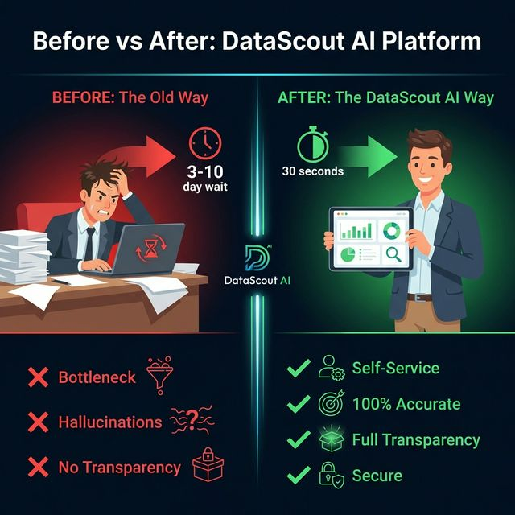
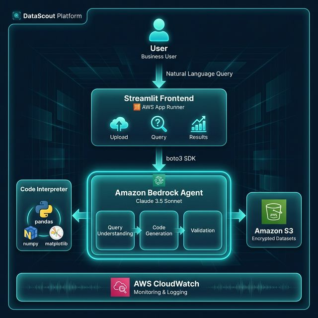
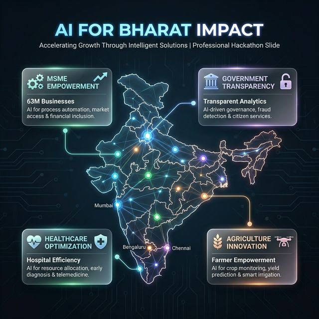

<h1 align="center">🔬 DataScout</h1>

<p align="center">
  <strong>Autonomous Enterprise Data Analyst — Powered by Claude 3.5 Sonnet on Amazon Bedrock</strong>
</p>

<p align="center">
  <em>Ask questions in plain English. Get 100% accurate, auditable answers in 30 seconds.</em>
</p>

<p align="center">
  <a href="#-quick-start">Quick Start</a> •
  <a href="#-how-it-works">How It Works</a> •
  <a href="#%EF%B8%8F-architecture">Architecture</a> •
  <a href="#-features">Features</a> •
  <a href="#-demo">Demo</a> •
  <a href="#-documentation">Docs</a>
</p>

<p align="center">
  🇮🇳 <strong>Built for AI for Bharat Hackathon — Amazon Web Services</strong>
</p>

---

## 🎯 What is DataScout?

DataScout is an **autonomous agentic AI system** that transforms how businesses interact with their data. Instead of waiting days for a data scientist to answer a question, any business user can **upload a dataset**, **ask a question in natural language**, and receive **mathematically verified results** — in under 30 seconds.

<p align="center">
  
</p>

### The Core Innovation

> Traditional AI tools **guess** numbers using text prediction.
> DataScout **computes** them by writing and executing real Python code.

| Feature | ❌ ChatGPT / Generic AI | ✅ DataScout |
|---------|------------------------|-------------|
| Result source | Text prediction (guessing) | **Python code execution** (computing) |
| Numerical accuracy | Often hallucinates numbers | **100% mathematically correct** |
| Transparency | Black box | **Full code shown to user** |
| Auditability | Not auditable | **Complete execution trace** |
| Data privacy | Data sent to third-party servers | **Data stays in your AWS account** |
| Enterprise security | Consumer-grade | **AES-256 encryption, IAM, audit logs** |

---

## 🚀 Quick Start

### Prerequisites

- Python 3.10+
- AWS CLI configured (`aws configure`)
- AWS account with Bedrock access

### Setup

```bash
# 1. Clone the repository
git clone <repo-url>
cd Data_scout

# 2. Create virtual environment
python -m venv venv
source venv/bin/activate        # macOS/Linux
# venv\Scripts\activate         # Windows

# 3. Install dependencies
pip install -r requirements.txt

# 4. Configure AWS resources
bash scripts/create_buckets.sh       # Create S3 bucket
bash scripts/create_iam_roles.sh     # Setup IAM roles
bash scripts/setup_agent.sh          # Deploy Bedrock Agent

# 5. Set environment variables
cp .env.example .env
# Edit .env → set BEDROCK_AGENT_ID, BEDROCK_AGENT_ALIAS_ID, S3_BUCKET

# 6. Launch the app
streamlit run streamlit_app/app.py
# → Opens at http://localhost:8501
```

> 💡 **Want to try with demo data first?** Run `python scripts/seed_demo_data.py` to generate sample datasets, then upload from `demo/datasets/`.

---

## ⚙️ How It Works

```
  ① UPLOAD              ② ASK                 ③ EXECUTE             ④ INSIGHTS
  ─────────            ──────                ──────────            ──────────
  📁 Drag & drop       💬 Type question      🐍 AI writes Python   📊 Tables + charts
  CSV, Excel, JSON     in plain English      code (pandas, numpy)   + full code shown
  Up to 100 MB         No SQL needed         Runs in AWS sandbox    Zero hallucination
```

### Under the Hood

1. **Upload** — Your dataset is encrypted (AES-256) and stored in Amazon S3
2. **Ask** — Claude 3.5 Sonnet on Bedrock understands your analytical intent
3. **Execute** — The AI generates Python code and runs it in a secure, air-gapped sandbox (no internet, no system access, 30-sec timeout)
4. **Insights** — You see: explanation → computed results → full Python code → auto-generated charts

---

## 🏗️ Architecture

### System Overview


<p align="center">
  
</p>

### Tech Stack

| Layer | Technology | Purpose |
|-------|-----------|---------|
| **Frontend** | Streamlit (Python) | Rapid data-app interface |
| **Hosting** | AWS App Runner | Serverless, auto-scaling |
| **AI Engine** | Amazon Bedrock Agents | Managed agent orchestration |
| **LLM** | Amazon Nova Pro | Code generation & reasoning |
| **Code Execution** | Bedrock Code Interpreter | Secure Python sandbox |
| **Storage** | Amazon S3 | Encrypted dataset storage |
| **Database** | Amazon DynamoDB | Query history & session persistence |
| **REST API** | AWS Lambda + API Gateway | Serverless API layer |
| **Security** | AWS IAM | Least-privilege access control |
| **Monitoring** | CloudWatch | Logging, metrics, audit trails |
| **IaC** | CloudFormation | Infrastructure as Code |

---

## ✨ Features

### Core Capabilities

- 📁 **Multi-Format Upload** — CSV, Excel (.xlsx/.xls), and JSON (up to 100 MB)
- 💬 **Natural Language Queries** — Ask questions in plain English
- 🐍 **Real Code Execution** — AI writes & runs Python code (never guesses numbers)
- 📊 **Auto Visualizations** — Bar charts, line plots, histograms, heatmaps via matplotlib/seaborn
- 💻 **Full Code Transparency** — See every line of generated Python code
- 🔄 **Conversation Context** — Ask follow-up questions within a session
- 📜 **Query History** — Browse and review all past analyses

### Security & Enterprise

- 🔒 **AES-256 Encryption** at rest (S3 server-side)
- 🔒 **TLS 1.2+** encryption in transit
- 🔒 **Air-Gapped Sandbox** — Code runs with zero network access
- 🔒 **Session Isolation** — No cross-session data access
- 🔒 **Auto Deletion** — Data removed after 7 days via lifecycle policies
- 🔒 **No Model Training** — User data never used for LLM training
- 🔒 **Audit Logging** — All operations logged to CloudWatch

### Supported Query Types

| Category | Example |
|----------|---------|
| Aggregation | *"What is the average revenue by region?"* |
| Ranking | *"Top 10 products by total sales"* |
| Trends | *"Show me monthly revenue trends"* |
| Correlation | *"Correlation between price and quantity"* |
| Distribution | *"Revenue distribution across categories"* |
| Statistics | *"Descriptive statistics for all numeric columns"* |
| Filtering | *"Show customers with orders > 10"* |
| Comparison | *"Compare profit margins across regions"* |

---

## 🎬 Demo

### Quick Demo with Sample Data

```bash
# Generate demo datasets
python scripts/seed_demo_data.py

# Start the app
streamlit run streamlit_app/app.py
```

Upload `demo/datasets/sales_data.csv` and try these queries:

| Query | Expected Output |
|-------|----------------|
| *"What are the top 5 products by total revenue?"* | Sorted table, 5 rows |
| *"Show me monthly revenue trends"* | Line chart, 12 data points |
| *"What is the average revenue by region?"* | Table with 4 regions |
| *"What is the correlation between quantity and revenue?"* | Coefficient [-1, 1] |
| *"Show profit distribution across categories"* | Histogram chart |

### Demo Datasets

| File | Records | Description |
|------|---------|-------------|
| `sales_data.csv` | 1,000 | Sales transactions with revenue, products, regions |
| `customer_data.csv` | 500 | Customer records with demographics |
| `product_catalog.json` | 5 | Product metadata and categories |

> 📖 Full demo script: [`demo/demo_script.md`](demo/demo_script.md)

---

## 🇮🇳 Impact — AI for Bharat

<p align="center">
  
</p>

DataScout is built to solve real problems for India's businesses and institutions:

| Sector | Impact |
|--------|--------|
| 🏭 **MSMEs** | 63M+ small businesses can make data-driven decisions without hiring data scientists |
| 🏛️ **Government** | Transparent, auditable analysis of census, health, and education data |
| 🌾 **Agriculture** | Crop yield patterns, market pricing, and weather analysis for 150M+ farmers |
| 🏥 **Healthcare** | Hospital resource optimization, patient flow analytics, drug inventory |
| 📈 **BFSI** | Fraud detection, portfolio analysis, regulatory compliance (DPDP Act 2023) |

---

## 📂 Project Structure

```
Data_scout/
├── streamlit_app/               # 🖥️ Frontend application
│   ├── app.py                   #    Main Streamlit entry point
│   ├── config.py                #    Environment config loader
│   ├── components/              #    UI widgets (upload, query, results, preview)
│   ├── services/                #    AWS integrations (Bedrock, S3, DynamoDB, sessions)
│   ├── utils/                   #    Helpers (logging, errors, formatters)
│   └── assets/                  #    Custom CSS styling
├── lambda_function/             # ⚡ AWS Lambda REST API
│   ├── handler.py               #    Lambda handler (analyze, health, history)
│   └── requirements.txt         #    Lambda-specific dependencies
├── demo/                        # 🎬 Demo assets
│   ├── datasets/                #    Pre-built sample data
│   └── demo_script.md           #    Step-by-step demo guide
├── scripts/                     # 🔧 Setup & automation
│   ├── setup_agent.sh           #    Deploy Bedrock Agent
│   ├── create_buckets.sh        #    Create & configure S3 bucket
│   ├── create_iam_roles.sh      #    IAM role setup
│   ├── seed_demo_data.py        #    Generate demo datasets
│   └── run_demo.py              #    Automated demo runner
├── cloudformation/              # ☁️ Infrastructure as Code
│   ├── datascout-stack.yaml     #    Full CloudFormation stack
│   ├── parameters/              #    Environment-specific params
│   └── scripts/                 #    Deployment helpers
├── tests/                       # 🧪 Test suite
├── Docs/                        # 📚 Documentation
│   ├── prd.md                   #    Product Requirements
│   ├── design.md                #    System Design Spec
│   ├── guide.md                 #    User Guide
│   ├── setup.md                 #    Setup Guide
│   ├── roadmap.md               #    Product Roadmap
│   ├── deployment.md            #    Deployment Guide
│   ├── switching_to_real_data.md #   Demo → Production Guide
│   └── hackathon_presentation_guide.md  # Hackathon PPT Guide
├── .env.example                 # ⚙️ Environment variable template
├── requirements.txt             # 📦 Python dependencies
├── Dockerfile                   # 🐳 Container configuration
├── pyproject.toml               # 🔧 Project metadata & tooling
└── LICENSE                      # 📄 MIT License
```

---

## 🔧 Configuration

### Environment Variables

```dotenv
# AWS Configuration
AWS_REGION=us-east-1
S3_BUCKET=datascout-storage

# Bedrock Agent (required)
BEDROCK_AGENT_ID=<your-agent-id>
BEDROCK_AGENT_ALIAS_ID=<your-alias-id>

# DynamoDB (query history)
DYNAMODB_TABLE=datascout-queries
ENABLE_DYNAMODB=true

# API Gateway (set after CloudFormation deploy)
API_GATEWAY_URL=

# Application Settings
DEBUG=false
LOG_LEVEL=INFO
SESSION_TIMEOUT_MINUTES=30
MAX_FILE_SIZE_MB=100
MAX_CONCURRENT_QUERIES=5
```

> 📖 See [`Docs/switching_to_real_data.md`](Docs/switching_to_real_data.md) for the full guide on configuring real AWS resources.

---

## 🗺️ Roadmap

| Phase | Timeline | Status | Key Deliverables |
|-------|----------|--------|-----------------|
| **Phase 1 — MVP** | Feb 2026 | ✅ Complete | Upload, NL query, code execution, charts, transparency |
| **Phase 2 — Core** | Feb–Apr 2026 | 🔄 In Progress | Multi-format, sessions, follow-ups, testing, CI/CD |
| **Phase 3 — Enterprise** | May–Jul 2026 | 📋 Planned | Auth (Cognito/SSO), RBAC, multi-dataset joins, SQL connectors |
| **Phase 4 — Platform** | Aug 2026–Jan 2027 | 📋 Planned | REST API, scheduled reports, multi-region, GDPR, SOC 2 |

> 📖 Full roadmap: [`Docs/roadmap.md`](Docs/roadmap.md)

---

## 📚 Documentation

| Document | Description |
|----------|-------------|
| [Product Requirements](Docs/prd.md) | Full PRD with user personas, stories, KPIs |
| [System Design](Docs/design.md) | Architecture, data flows, security design |
| [User Guide](Docs/guide.md) | End-user guide with query tips |
| [Setup Guide](Docs/setup.md) | Installation & configuration steps |
| [Deployment Guide](Docs/deployment.md) | Production deployment on AWS |
| [AWS Infrastructure Guide](Docs/aws_infrastructure_guide.md) | Beginner-friendly setup of all 9 AWS services |
| [Switching to Real Data](Docs/switching_to_real_data.md) | Demo → production migration |
| [Hackathon Guide](Docs/hackathon_presentation_guide.md) | Presentation guide for AI for Bharat |
| [Roadmap](Docs/roadmap.md) | 12-month product roadmap |

---

## 🧪 Testing

```bash
# Run all tests
pytest tests/ -v

# Run with coverage
pytest tests/ --cov=streamlit_app --cov-report=html
```

---

## 🐳 Docker

```bash
# Build
docker build -t datascout .

# Run
docker run -p 8501:8501 --env-file .env datascout
```

---

## 🤝 Contributing

1. Fork the repository
2. Create a feature branch (`git checkout -b feature/amazing-feature`)
3. Commit your changes (`git commit -m 'Add amazing feature'`)
4. Push to branch (`git push origin feature/amazing-feature`)
5. Open a Pull Request

---

## 📄 License

This project is licensed under the MIT License — see the [LICENSE](LICENSE) file for details.

---

<p align="center">
  <strong>Built with ❤️ for Bharat</strong><br/>
  Powered by Amazon Bedrock • Claude 3.5 Sonnet<br/>
  <em>Zero Hallucinations • Full Transparency • Enterprise Security</em>
</p>
